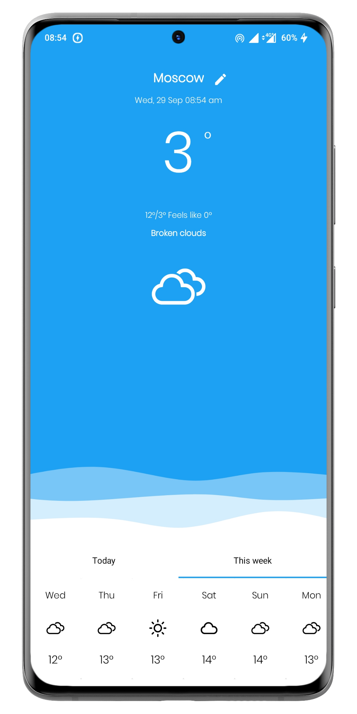
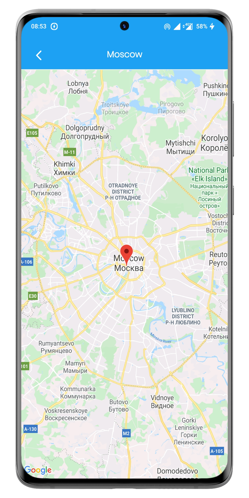
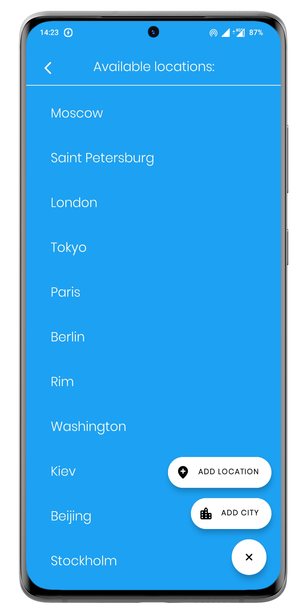
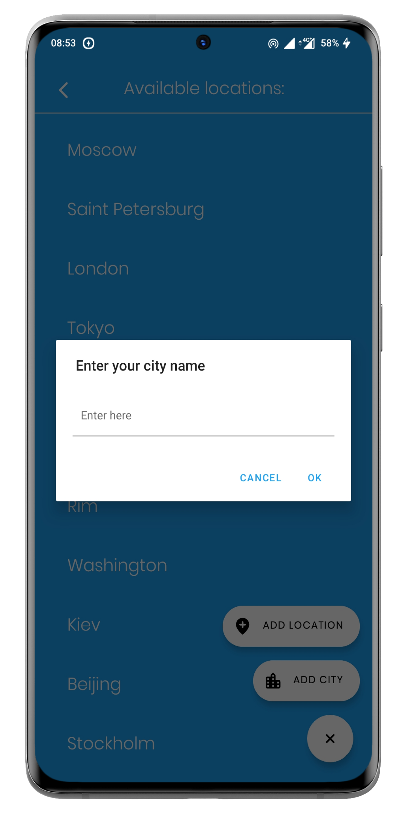

<h1 align="center">Weather</h1>

- Simple app to check weather around you :)
- You can find city by searching or your current position
- Using Google APIs for searching and OpenWeatherAPI for weather data

<br />

<p align="left">
  
</p>

## Tech stack & Open-source libraries
- Minimum SDK level 21
- [Kotlin](https://kotlinlang.org/) - 100%
- JetPack
    - [Room](https://developer.android.com/training/data-storage/room) - Constructing a database using the abstract layer.
    - [RecyclerView](https://developer.android.com/guide/topics/ui/layout/recyclerview) - Display large sets of data in your UI while minimizing memory usage.
    - [ViewPager 2](https://developer.android.com/jetpack/androidx/releases/viewpager2) - Display Views or Fragments in a swipeable format (used for welcome screens).
    - [View Binding](https://developer.android.com/topic/libraries/view-binding) - Allows you to more easily write code that interacts with views.
- [GoogleMaps](https://developers.google.com/maps) - View and interact with Google Maps using Api.
- [Glide](https://github.com/bumptech/glide) - Loading images asynchronously.
- [Retrofit](https://square.github.io/retrofit/) - For API HTTP calls

Weather + Map Screens
-----------

<p float="left">
  
  
</p>

List of cities Screens
-----------

- Full authentication and registration logic via Firebase
- Error checking during filling fields

<p float="left">
  
   
</p>

# License
```
    Weather App
    Copyright 2021
    Ryabyshev Oleg,
    Android Kotlin Developer
    Russia, Moscow
```
